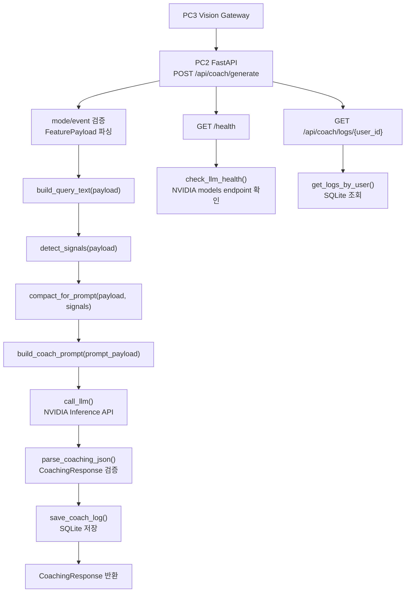
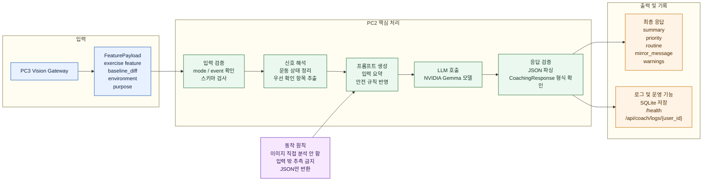

# PC2 구조 정리

이 문서는 `pc2_coach_server` 기준으로 프로젝트를 설명할 때 바로 쓸 수 있는 두 가지 다이어그램을 정리한 문서입니다.

- 프로젝트 구조도: 실제 폴더와 파일 기준
- API 처리 흐름도: `POST /api/coach/generate` 실행 기준

## 1. 프로젝트 구조도

```mermaid
flowchart TD
    root["pc2_coach_server/"]

    root --> app["app/"]
    root --> data["data/"]
    root --> docs["docs/"]
    root --> scripts["scripts/"]
    root --> readme["README.md"]
    root --> req["requirements.txt"]
    root --> env[".env.example"]

    app --> main["main.py<br/>FastAPI entrypoint<br/>health, generate, logs"]
    app --> config["config.py<br/>환경변수 로드"]
    app --> db["db.py<br/>SQLite 로그 저장/조회"]
    app --> llm["llm_client.py<br/>NVIDIA LLM 호출/health"]
    app --> prompt["prompt_manager.py<br/>system/user prompt 생성"]
    app --> validator["output_validator.py<br/>LLM JSON 파싱/검증"]
    app --> rag["rag_service.py<br/>query_text, signal 추출, prompt compact"]
    app --> schemas["schemas/"]

    schemas --> coaching["coaching.py<br/>FeaturePayload, CoachingResponse"]

    data --> ragdocs["rag_docs/"]
    ragdocs --> doc1["pc2_coach_rules.md"]
    ragdocs --> doc2["exercise_rules.md"]
    ragdocs --> doc3["appearance_rules.md"]
    ragdocs --> doc4["sensor_warning_rules.md"]
    ragdocs --> doc5["workout_rules.md"]

    docs --> spec1["pc2_prompt_contract.md"]
    docs --> spec2["pc3_payload_request.md"]
    docs --> spec3["pc2_integration_guide.md"]

    scripts --> run["run_pc2.sh"]
    scripts --> smoke["smoke_pc2.py"]
```



## 2. API 처리 흐름도



## 3. 한 줄 설명 버전

프로젝트 구조도는 실제 코드 파일 배치를 보여주고, API 처리 흐름도는 `FeaturePayload`가 들어와서 signal 추출, prompt 생성, LLM 호출, JSON 검증, 로그 저장을 거쳐 `CoachingResponse`로 반환되는 실행 순서를 보여줍니다.

## 4. 발표용 짧은 설명

```text
PC3가 vision feature를 정리한 FeaturePayload를 PC2로 보내면,
PC2는 입력을 검증하고 signal을 추출한 뒤,
prompt를 만들어 NVIDIA LLM에 전달합니다.
이후 응답 JSON을 검증하고 SQLite에 로그를 저장한 다음,
최종 CoachingResponse만 반환합니다.
```

## 5. 보고서용 구조도

아래 Mermaid는 참고 이미지처럼 상단에 PC2 서비스를 두고, 실제 폴더와 핵심 파일을 아래로 펼친 보고서용 구조도입니다.

```mermaid
f
lowchart TD
    root["pc2-coach-api<br/>PC2 Coach Server"]

    root --> app["app<br/>핵심 API 로직"]
    root --> docs["docs<br/>연동/계약 문서"]
    root --> data["data<br/>규칙 문서 및 DB 경로"]
    root --> scripts["scripts<br/>실행 및 점검"]
    root --> configfiles["설정 파일"]

    app --> main["main.py<br/>FastAPI 진입점<br/>health / generate / logs"]
    app --> schema["schemas/coaching.py<br/>FeaturePayload / CoachingResponse 스키마"]
    app --> prompt["prompt_manager.py<br/>코칭 프롬프트 생성"]
    app --> rag["rag_service.py<br/>입력 요약 / signal 추출"]
    app --> llm["llm_client.py<br/>NVIDIA LLM 호출 / health 확인"]
    app --> validator["output_validator.py<br/>LLM JSON 파싱 / 응답 검증"]
    app --> db["db.py<br/>SQLite 로그 저장 / 조회"]
    app --> appconfig["config.py<br/>환경변수 로드"]

    docs --> contract["pc2_prompt_contract.md<br/>PC3 ↔ PC2 입력/출력 계약"]
    docs --> payload["pc3_payload_request.md<br/>PC3 요청 payload 명세"]
    docs --> guide["pc2_integration_guide.md<br/>연동 가이드"]

    data --> ragdocs["rag_docs<br/>코칭 규칙 문서"]
    ragdocs --> coachrules["pc2_coach_rules.md"]
    ragdocs --> exerules["exercise_rules.md"]
    ragdocs --> apprules["appearance_rules.md"]
    ragdocs --> sensorrules["sensor_warning_rules.md"]
    ragdocs --> workoutrules["workout_rules.md"]

    scripts --> run["run_pc2.sh<br/>PC2 서버 실행"]
    scripts --> smoke["smoke_pc2.py<br/>스모크 테스트"]

    configfiles --> readme["README.md<br/>서비스 개요 / 실행 방법"]
    configfiles --> env[".env.example<br/>포트 / 모델 / DB 설정"]
    configfiles --> req["requirements.txt<br/>의존성 목록"]
```

## 6. 보고서용 설명 문장

```text
PC2 Coach Server는 FastAPI 기반의 코칭 생성 서비스이며,
app 폴더에 API 엔드포인트, 입력 스키마, signal 추출, 프롬프트 생성,
LLM 호출, 응답 검증, 로그 저장 기능이 모듈별로 분리되어 있다.
docs 폴더에는 PC3와의 연동 계약 및 payload 명세가 정리되어 있고,
data/rag_docs에는 운동 계획 생성 규칙 문서가 저장된다.
scripts는 서버 실행과 스모크 테스트를 담당하며,
루트 설정 파일은 실행 환경과 의존성을 관리한다.
```

## 7. 서비스 역할 요약도

아래 Mermaid는 너무 길게 늘어놓지 않고, `입력`, `핵심 처리`, `출력 및 기록`으로 나눠서 PC2의 역할이 한눈에 보이도록 정리한 발표용 버전입니다.



## 8. 서비스 역할 설명 문장

```text
PC2는 비전 모델이 아니다.
이 서비스는 PC3가 먼저 분석해 만든 FeaturePayload를 입력으로 받아,
운동 자세 상태를 직접 다시 인식하는 대신
이미 정리된 feature를 해석하고 우선순위를 정한 뒤,
LLM을 이용해 사용자에게 보여줄 코칭 문장으로 변환한다.
즉, PC2의 핵심 역할은 이미지 분석이 아니라
'정리된 센서/비전 결과를 안전한 코칭 응답으로 바꾸는 것'이다.
```
